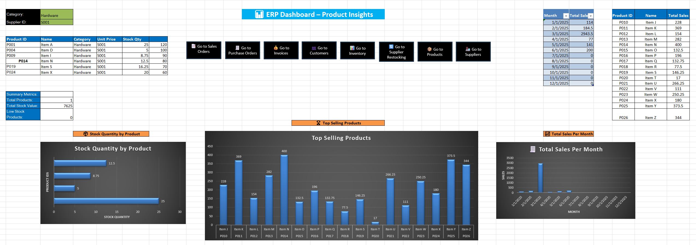

# 🧮 ERP Dashboard – Excel-Based Distribution System

This project simulates a lightweight **Enterprise Resource Planning (ERP)** dashboard using **Microsoft Excel**. It mimics the core functionality of systems like **Infor SX.e** or **CloudSuite Distribution**, focusing on product insights, sales, purchasing, and supplier operations.

## 📊 Dashboard Preview

---

## 🧩 Features

- 📦 Product Master Table with Stock & Pricing
- 🧾 Sales Orders and Purchase Orders
- 👥 Customers and Suppliers Database
- 📈 Visual Dashboard:
  - Stock Quantity by Product
  - Top Selling Products
  - Monthly Sales Trends
- 📌 Interactive buttons for quick navigation across sheets
- 📉 Summary metrics (e.g., low stock alerts)

---

## 🛠️ Skills Demonstrated

- **Excel Automation** with formulas, pivot tables, dynamic charts
- **Business Logic** modeling for inventory, orders, and suppliers
- **Dashboard Design** with real-world ERP use cases in mind
- Transferable skills to ERP platforms like SAP, Infor, or NetSuite

---

## 📁 Files Included

- `ERP_Dashboard_Mehdi.xlsx` – Full working Excel ERP system
- `screenshots/dashboard-overview.png` – Preview image
- *(Optional)* `SupplierRestockingAutomation.xlsx` – If you add macro logic

---

## 🚀 Future Expansion Ideas

- Convert to a **Google Sheets App** with Apps Script logic
- Build a **Python version** using Pandas for automation
- Rebuild as a **Flask or React web-based ERP demo**
- Import into **Power BI** or **Tableau** for modern BI dashboards

